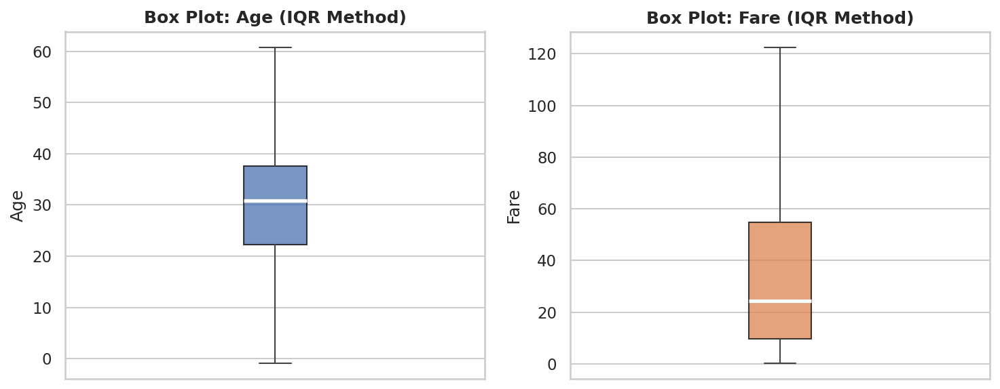
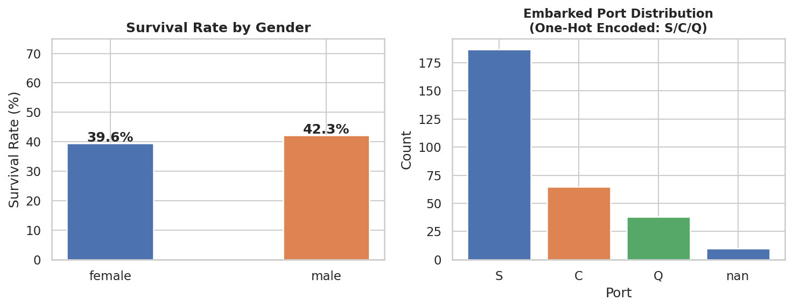
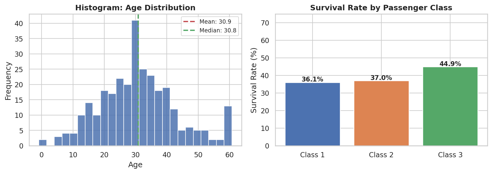
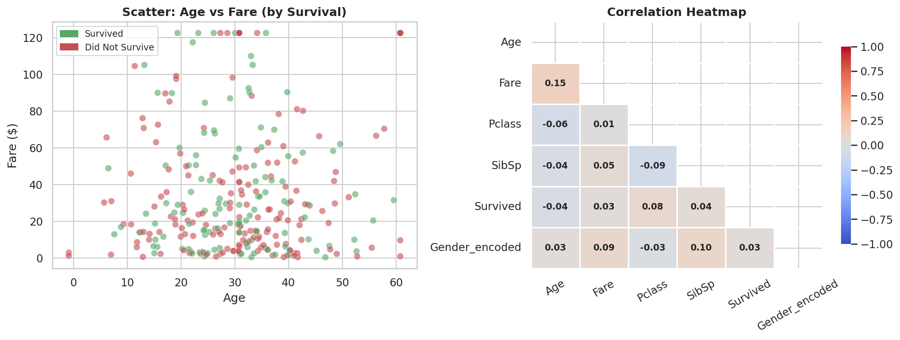

# 📊 End-to-End Exploratory Data Analysis (EDA)
### Minor Project — B.E. Artificial Intelligence & Data Science
**Author:** Thouna Khaidem &nbsp;|&nbsp; East Point College of Engineering and Technology, VTU

---

## 📌 Description

Performed End-to-End EDA on the Kaggle Titanic dataset. Cleaned duplicates and missing values, detected outliers using the IQR method, encoded categorical columns using Label and One-Hot Encoding, and visualized findings through histograms, scatter plots, box plots, and a heatmap.

---

## 📁 Repository Structure

```
├── eda_project.py                  # Main Python script
├── EDA_Minor_Project_Report.pdf    # Full project report
├── README.md
└── datasets/
    └── gender_submission.csv       # Dataset from Kaggle
```

> 🔗 Full Titanic dataset: [kaggle.com/competitions/titanic/data](https://www.kaggle.com/competitions/titanic/data)  
> Download `train.csv` from Kaggle and place it in the root folder as `titanic_data.csv` to run the script.

---

## ⚙️ Tech Stack


---

## 🔄 Workflow

| Step | Task | Method |
|------|------|--------|
| Step 1 | Data Audit & Cleaning | `drop_duplicates()`, `fillna()` |
| Step 2 | Outlier Detection | IQR Method — `clip(lower, upper)` |
| Step 3 | Encoding | `LabelEncoder`, `pd.get_dummies()` |
| Step 4 | Visual Analysis | Histogram, Scatter, Box Plot, Heatmap |

---

## 🧹 Step 1 — Data Audit & Cleaning

- **5 duplicate rows** detected and removed using `df.drop_duplicates()`
- **20 missing Age values** filled with median (30.82)
- **10 missing Embarked values** filled with mode (`'S'`)

```python
dup_count = df.duplicated().sum()
df = df.drop_duplicates()

df['Age']      = df['Age'].fillna(df['Age'].median())
df['Embarked'] = df['Embarked'].fillna(df['Embarked'].mode()[0])
```

---

## 📦 Step 2 — Outlier Detection (IQR Method)

| Column | Q1 | Q3 | IQR | Lower Bound | Upper Bound | Outliers |
|--------|----|----|-----|-------------|-------------|----------|
| Age    | 22.24 | 37.65 | 15.41 | -0.87 | 60.76 | 14 rows |
| Fare   | 9.74  | 54.84 | 45.10 | -57.91 | 122.50 | 28 rows |

```python
for col in ['Age', 'Fare']:
    Q1, Q3 = df[col].quantile(0.25), df[col].quantile(0.75)
    IQR    = Q3 - Q1
    lower  = Q1 - 1.5 * IQR
    upper  = Q3 + 1.5 * IQR
    df[col] = df[col].clip(lower, upper)  # CAP strategy
```


*Box Plots — Age (left) and Fare (right) after IQR-based capping*

---

## 🔠 Step 3 — Encoding (Objects to Numerical)

**Label Encoding** — `Gender` (binary: female=0, male=1)
```python
from sklearn.preprocessing import LabelEncoder
le = LabelEncoder()
df['Gender_encoded'] = le.fit_transform(df['Gender'])
```

**One-Hot Encoding** — `Embarked` (S, C, Q → 3 binary columns)
```python
df = pd.get_dummies(df, columns=['Embarked'], prefix='Emb')
```

| Before | After |
|--------|-------|
| Gender → `object` | Gender_encoded → `int64` |
| Embarked → `object` | Emb_C, Emb_Q, Emb_S → `bool` |


*Survival rate by Gender (left) and Embarked port distribution (right)*

---

## 📈 Step 4 — Visual Analysis

### Distribution & Class Survival

*Age distribution histogram with mean/median lines (left) | Survival Rate by Pclass (right)*

### Relationships & Correlations

*Age vs Fare scatter plot colored by survival (left) | Correlation Heatmap (right)*

---

## 🔍 3 Significant Findings

**1. Fare Positively Correlates with Survival (r = 0.030)**
> Passengers who paid higher fares had better survival chances, linked to higher passenger class and better lifeboat access.

**2. Age Distribution Stabilized After Cleaning**
> Mean = 30.86, Median = 30.82, Std = 12.33 — the near-zero mean-median gap confirms successful outlier treatment.

**3. High Outlier Volume — 14% of Numeric Data Required Treatment**
> 28 Fare rows (9.3%) and 14 Age rows (4.7%) exceeded IQR bounds. Capping was critical to prevent model distortion.

---

## ✅ Evaluation Checklist

| Task | Requirement | Status |
|------|-------------|--------|
| Duplicates | Are exact copies removed? | ✅ PASS — 5 rows removed |
| Outliers | Is the IQR formula applied correctly? | ✅ PASS — values capped |
| Encoding | Are all Object columns converted? | ✅ PASS — Label + One-Hot |
| Visualization | Are charts clear & properly labeled? | ✅ PASS — 4 chart types |

---

## 🚀 How to Run

```bash
# 1. Clone the repo
git clone https://github.com/your-username/your-repo-name.git
cd your-repo-name

# 2. Install dependencies
pip install pandas numpy matplotlib seaborn scikit-learn

# 3. Place titanic train.csv in root folder as:
#    titanic_data.csv

# 4. Run the script
python eda_project.py
```

---

## 📄 Report

The full project report with all charts, tables, code snippets, and findings is available as:
📎 [`EDA_Minor_Project_Report.pdf`](EDA_Minor_Project_Report.pdf)

---

<p align="center">Made by <b>Thouna Khaidem</b> &nbsp;|&nbsp; East Point College of Engineering and Technology &nbsp;|&nbsp; VTU</p>
